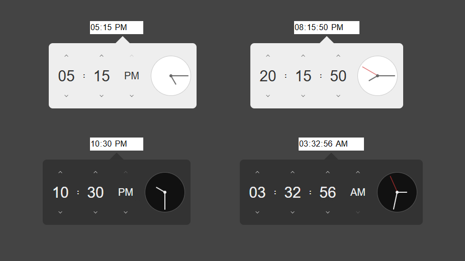

# React Modern Time Picker



# Install
```
npm i react-modern-time-picker
```

# How to use
First, import the library and styles file.
```tsx
import TimePicker from 'react-modern-time-picker';
import 'react-modern-time-picker/dist/styles.css';
```

Then use the component:
```tsx
<TimePicker />
```

# Props
| Name           | Type                      | Description              |
|----------------|---------------------------|--------------------------|
| is24HourFormat | `boolean`                 | 12 or 24 hour format     |
| withSeconds    | `boolean`                 | Adding seconds to time   |
| defaultValue   | `string`                  | Default time value       |
| theme          | `light`, `dark`           | Change time picker theme |
| onChange       | `(value: string) => void` | Callback method          |

* The value type is string with the format `00:00:00` or `00:00`.
* All props ​​are optional.
* If `defaultValue` not provided, the current time will be used instead.

# Example
```tsx
<TimePicker
   defaultValue='13:00'
   theme='dark'
   is24HourFormat={true}
   withSeconds={false}
   onChange={(value) => {
      console.log(value)
   }}
/>
```